<p align="center">
  
</p>

<h1 align="center">Medora</h1>

<p align="center">
  Bilingual, consent-governed research software for patient-held health records,
  human-reviewed clinical drafts, specialty navigation, and appointment coordination
  in Bangladesh.
</p>

<p align="center">
  <a href="https://medorahealth.vercel.app"></a>
  <a href="https://doi.org/10.5281/zenodo.21846125"></a>
  <a href="LICENSE"></a>
  <a href="docs/BCOLBD/Whitepaper/medora_bcolbd_whitepaper.pdf"></a>
</p>

<p align="center">
  <a href="https://medorahealth.vercel.app">Live demo</a> ·
  <a href="docs/BCOLBD/Whitepaper/medora_bcolbd_whitepaper.pdf">Medora 2.0 whitepaper</a> ·
  <a href="docs/softwarex/medora_softwarex.tex">SoftwareX manuscript</a> ·
  <a href="docs/INDEX.md">Documentation index</a> ·
  <a href="docs/REPRODUCING.md">Reproduce the evidence</a>
</p>

> [!IMPORTANT]
> Medora has not been clinically validated, independently security-audited, or
> cleared as a medical device. It is research software, not a diagnostic,
> autonomous-prescribing, counselling, or emergency-dispatch system. OCR,
> generated summaries, and specialty candidates are drafts that require human
> judgment.

## Why Medora exists

Health software can call a capable model without answering the harder questions:
which patient data may leave the system, which recipient may receive it, what the
output is allowed to do, and who confirms it before it has an effect. Medora puts a
deterministic policy boundary around assistive AI instead of treating a prompt as
an access-control mechanism.

The platform combines:

- an installable English/Bangla patient and clinician interface;
- purpose-, provider-, scope-, and time-bound consent;
- source-linked summaries and review-gated prescription extraction;
- deterministic emergency red flags and specialty navigation with manual fallback;
- transactional appointment creation, audit evidence, and post-commit events; and
- a reproducible Bangladesh medicine identity corpus.

## Interface tour

### English and Bangla dashboards

<p align="center">
  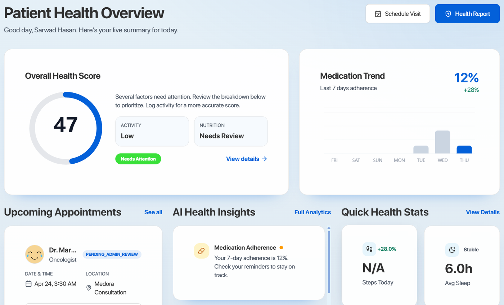
  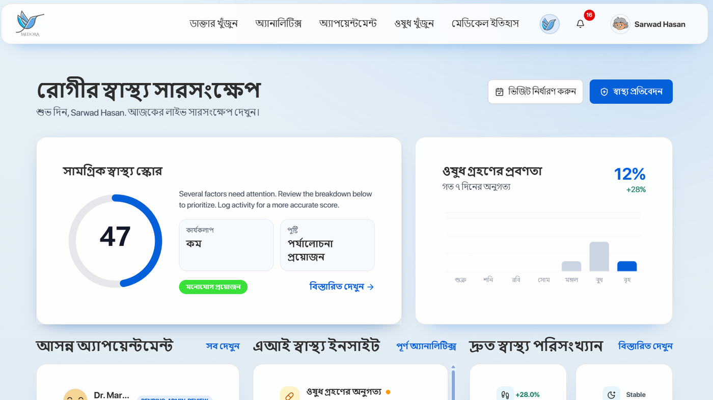
</p>

### Mobile-first patient workflows

<p align="center">
  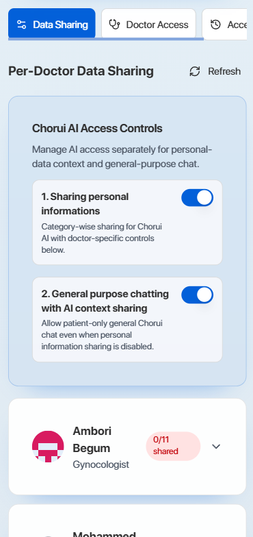
  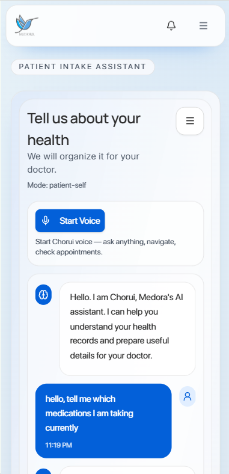
  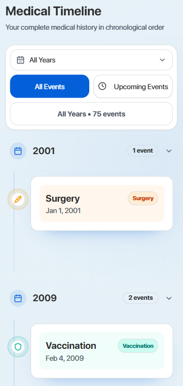
</p>

<p align="center"><sub>Per-doctor sharing · assistive patient intake · chronological record history</sub></p>

<details>
<summary><strong>Open the complete interface gallery</strong></summary>

#### Consent is a product surface

<p align="center">
  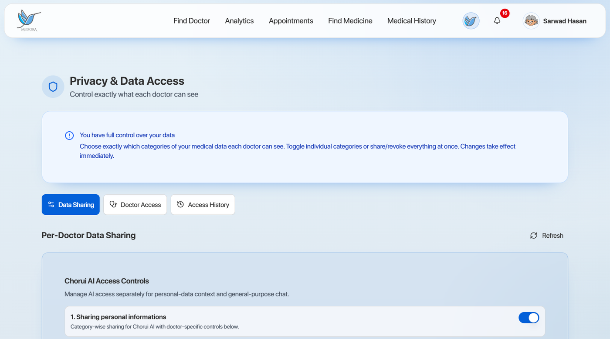
  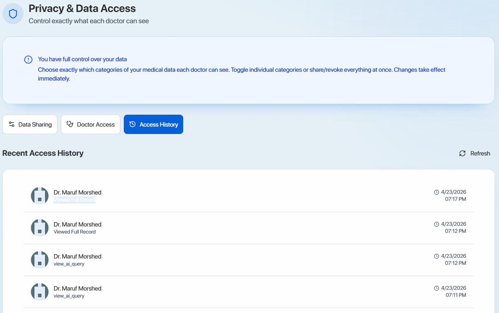
</p>

#### Assistive AI remains bounded and inspectable

<p align="center">
  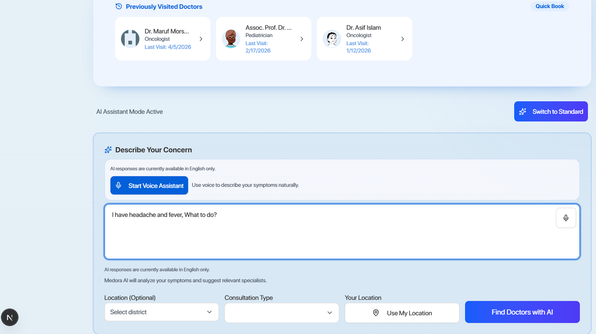
  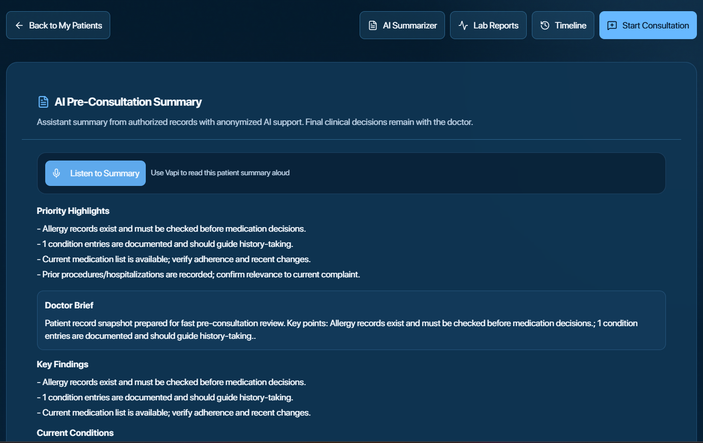
</p>

#### Prescription extraction is a review queue, not an authoritative write

<p align="center">
  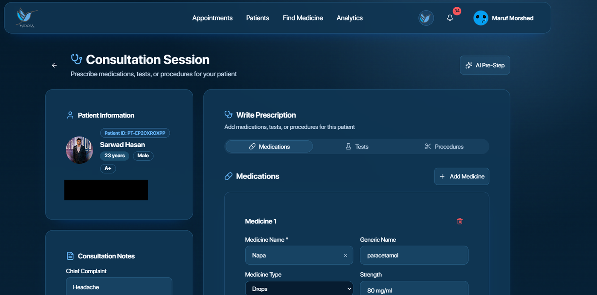
</p>

</details>

All screenshots are research/demo surfaces. They show implemented interaction
boundaries; they do not establish clinical safety or medical-device performance.

## What the system provides

| Surface | Implemented capability | Safety or authority boundary |
|---|---|---|
| Patient PWA | Records, timeline, appointments, sharing, access history, bilingual intake | Patient controls recipient/category sharing; manual workflows remain available |
| Clinician workflow | Source-linked summaries, consultation drafts, prescription review | A clinician edits or confirms before an authoritative write |
| Chorui navigation | Normalized intent, registry lookup, specialty candidates, emergency red flags | Navigation rather than diagnosis; red flags pre-empt model execution |
| Prescription OCR | Local/cloud extraction, parsing, medicine matching, row metadata | `authoritative_writeback=false`; accuracy is not claimed |
| Appointment system | Idempotent booking, active-slot uniqueness, audit and outbox records | PostgreSQL is authoritative; publish occurs only after commit |
| Research layer | Frozen fixtures, benchmark reporters, release receipts, corpus build scripts | Sample sizes and limitations ship beside every reported metric |

## Architecture

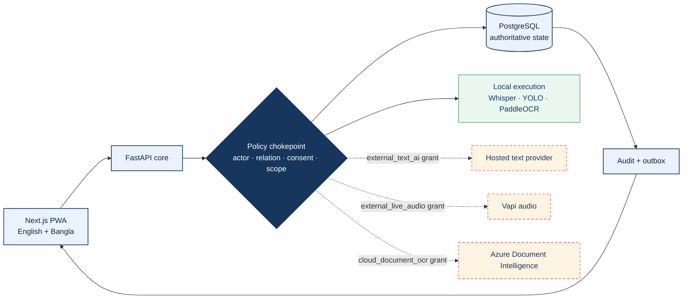

External text, audio, and document OCR are separate recipients. A grant for one
does not authorize another. Local mode never silently becomes a cloud request, and
revocation blocks future use without pretending that an earlier disclosure can be
retrieved.

## Medora 2.0 research framework

The competition whitepaper extends the deployed v1 foundation into five separately
testable artifacts. Build status and measurement status are kept separate: a runnable
gate is not presented as an experimental result until its required run exists.

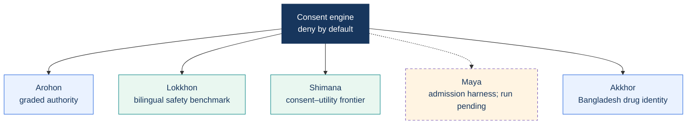

| Layer | Repository status | Evidence boundary |
|---|---|---|
| Arohon | Deployed policy core, 21 endpoint declarations, tier/risk logging, L3 emergency/crisis surfaces | Assistive only; no autonomous dispatch |
| Lokkhon | Versioned v0.1 five-axis benchmark release | Constructed fixtures, not population-level clinical performance |
| Shimana | Reporter and 24-case sweep complete | Binary grounded-contract utility; paired rows unavailable on the archived aggregate sweep |
| Maya | Admission harness and hard candidate-model check complete | No base-vs-tuned response run; no performance result claimed |
| Akkhor | Versioned `/v1/akkhor` API and package documentation complete | Repository API exists; separately hosted availability is not claimed |
| Learned PHI span recognition | Corpus, train/evaluate code, ONNX union runtime and regression gate complete | No weights; model and union metrics remain unavailable |
| Administrative stewardship | Fail-closed scoped-role thin slice, two-person destructive actions, notifying L4 break-glass and destructive/break-glass evidence explorer complete | Canonical organizations, affiliations, DSAR, delegated grants, comprehensive legacy-action audit coverage and combined cross-table compliance exploration remain proposed |

Read the [eight-page whitepaper](docs/BCOLBD/Whitepaper/medora_bcolbd_whitepaper.pdf),
its [claim–evidence map](docs/BCOLBD/Whitepaper/claim-evidence-map.md), and the
[adversarial self-review](docs/BCOLBD/Whitepaper/self-review.md).

## Current evidence boundary

These figures describe the archived/repository evidence; they are not
population-level clinical-performance claims.

| Evidence artifact | Current result | Source |
|---|---:|---|
| Privacy/redaction suite | 134 cases; 94.7% span precision; 75.5% recall; 3.2% false redaction; 43 limitations | [`safety_results.json`](docs/softwarex/generated/safety_results.json) |
| Current rule regression (development set) | 134 cases; 96.9% precision; 100% recall; the set is saturated, not a generalization estimate | [`safety_results.json`](tests/benchmarks/reports/safety_results.json) |
| Novel-identifier PHI probe | 36 spans; rules precision 100%, recall 75%; all nine misses are unseen unlabelled names | [`phi_ner_eval.json`](tools/phi_ner/reports/phi_ner_eval.json) |
| Shimana consent sweep | `L+K+R` non-dominated at utility 0.333 and exposure 958/1k; utility is non-monotone | [`shimana_report.json`](tests/benchmarks/reports/shimana_report.json) |
| Clinician-reviewed navigation fixtures | 30 fixtures; 0 emergency false negatives; 5 false positives | [`safety_results.json`](docs/softwarex/generated/safety_results.json) |
| Source-grounded summaries | 12 deterministic-mock fixtures with source accounting | [`safety_results.json`](docs/softwarex/generated/safety_results.json) |
| Booking contention | 30/30 unique commits at concurrency 2, 10, and 50 | [`booking_results.json`](docs/softwarex/generated/booking_results.json) |
| Medicine reference | 71,795 source rows; 7,389 canonical drugs; 67,001 brands | [`data/medicine_reference`](data/medicine_reference) |
| Assistive-AI surface | 21 endpoints in nine groups; 19 AI/ML components, 13 deterministic | [SoftwareX manuscript](docs/softwarex/medora_softwarex.tex) |

Prescription OCR is the principal negative result: the handwriting pipeline did
not reach usable accuracy, no accuracy number is published, and the identifiable
image corpus is excluded because its original permission does not establish consent
for permanent public redistribution.

## Repository map

| Path | Purpose |
|---|---|
| [`frontend/`](frontend) | Next.js 16 / React 19 installable PWA and bilingual user workflows |
| [`backend/`](backend) | FastAPI core, authorization, consent, appointments, audit, outbox, and provider orchestration |
| [`ai_service/`](ai_service) | Separate FastAPI OCR service with local and consent-gated cloud paths |
| [`data/medicine_reference/`](data/medicine_reference) | Deterministic Bangladesh medicine corpus build and generated reference data |
| [`tests/`](tests) | Unit, integration, security, end-to-end, performance, and frozen benchmark protocols |
| [`tools/ocr_annotation/`](tools/ocr_annotation) | Loopback annotation, blinded review, and adjudication workspace |
| [`docs/softwarex/`](docs/softwarex) | Submitted manuscript source, release metadata, generated evidence, and reviewer material |
| [`docs/BCOLBD/`](docs/BCOLBD) | Medora 2.0 plans, competition rules, whitepaper source, figures, and review artifacts |
| [`docs/`](docs) | Architecture, deployment, governance, workflow, API, testing, and reproduction guides |

## Version provenance and SoftwareX

Active development and a reproducible publication snapshot serve different jobs:

| Reference | Meaning |
|---|---|
| [`main`](https://github.com/CSE-3200-System-Project/Medora) | Evolving development branch; may contain post-submission features, documentation, and research protocols |
| [`v1.0.2`](https://github.com/CSE-3200-System-Project/Medora/tree/v1.0.2) | Immutable release tag used by the SoftwareX submission |
| [`7a7dae6c7fd4`](https://github.com/CSE-3200-System-Project/Medora/tree/7a7dae6c7fd4) | Exact archived source commit |
| [`10.5281/zenodo.21846125`](https://doi.org/10.5281/zenodo.21846125) | Permanent version-specific software archive |
| [`10.5281/zenodo.21844459`](https://doi.org/10.5281/zenodo.21844459) | Concept DOI spanning Medora releases |

Do not move or recreate the `v1.0.2` tag. New work belongs on `main`; a change that
must become part of the reviewed SoftwareX artifact should receive a new version and
archive, with the manuscript/revision letter updated to state exactly what changed.
This keeps the submitted evidence reproducible while allowing the project to continue.

## Local development

Prerequisites: Python 3.11, Node.js 20, PostgreSQL 16, and optional credentials
for the hosted provider paths you intend to exercise. Deterministic mock tests and
local-only workflows do not require paid-provider credentials.

### Frontend

```powershell
cd frontend
npm ci
npm run dev
```

### Core API

```powershell
cd backend
python -m venv venv
venv\Scripts\python.exe -m pip install -r requirements.txt
venv\Scripts\python.exe -m alembic upgrade head
venv\Scripts\python.exe -m uvicorn app.main:app --reload --port 8000
```

### OCR API

```powershell
cd ai_service
python -m venv venv
venv\Scripts\python.exe -m pip install -r requirements.txt
venv\Scripts\python.exe -m uvicorn app.main:app --reload --port 8001
```

Copy the relevant example environment files and provide only the values required
for the selected mode. Never commit provider credentials or patient data.

## Test and reproduce

```powershell
bash run_tests.sh
cd frontend
npm run lint
npm run build
```

For a fast Python pass without Docker:

```powershell
$env:MEDORA_SKIP_DOCKER='1'
bash run_tests.sh
```

The release-evidence workflow, exact targeted suites, environment constraints,
and failure semantics are documented in [REPRODUCING.md](docs/REPRODUCING.md).
Required live-provider benchmarks fail when credentials are absent; they are never
recorded as skipped passes.

## Consent and data semantics

| Purpose | External recipient | Local/manual alternative |
|---|---|---|
| `external_text_ai` | Selected hosted text provider | Deterministic mock for tests; manual workflow |
| `cloud_document_ocr` | Azure Document Intelligence | PaddleOCR/YOLO local mode |
| `external_live_audio` | Vapi | Local faster-whisper workflow |
| `clinical_sharing` | Named clinician | Patient retains unshared categories |
| `research_export` | Named export recipient | No export |

A grant records subject, recipient/provider, purpose, scopes, policy version,
validity, grant/revocation time, and audit metadata. Bilingual identifier patterns
are redacted before hosted text processing, and external requests use random
correlation IDs. This lowers exposure; it does not make content anonymous or
guarantee removal of unknown identifiers. Raw OCR, prompt, transcript, and finding
logs are disabled by default.

See [data governance](docs/DATA_GOVERNANCE.md), the
[role/permission matrix](docs/ROLE_PERMISSION_MATRIX.md), and the
[AI-system architecture](docs/architecture/ai-system.md).

## Documentation

- [Documentation index](docs/INDEX.md)
- [Project overview](docs/PROJECT_OVERVIEW.md)
- [Deployment guide](docs/DEPLOYMENT.md)
- [Backend architecture](docs/architecture/backend.md)
- [Frontend architecture](docs/architecture/frontend.md)
- [Database architecture](docs/architecture/database.md)
- [AI workflows](docs/workflows/ai-flows.md)
- [Appointment workflow](docs/workflows/appointments.md)
- [Testing and benchmarking](docs/testing-benchmarking.md)
- [SoftwareX release explanation](docs/softwarex/explanation.md)

## Citation and licensing

Code is licensed under the [MIT License](LICENSE). Authored annotations,
synthetic fixtures, and generated results use CC BY 4.0. Identifiable prescription
images are excluded from both blanket licenses; see
[`samples/DATA_USE_NOTICE.md`](samples/DATA_USE_NOTICE.md).

Citation metadata is provided in [`CITATION.cff`](CITATION.cff). For work that
depends on the submitted SoftwareX artifact, cite the immutable `v1.0.2` archive
rather than the moving `main` branch.
